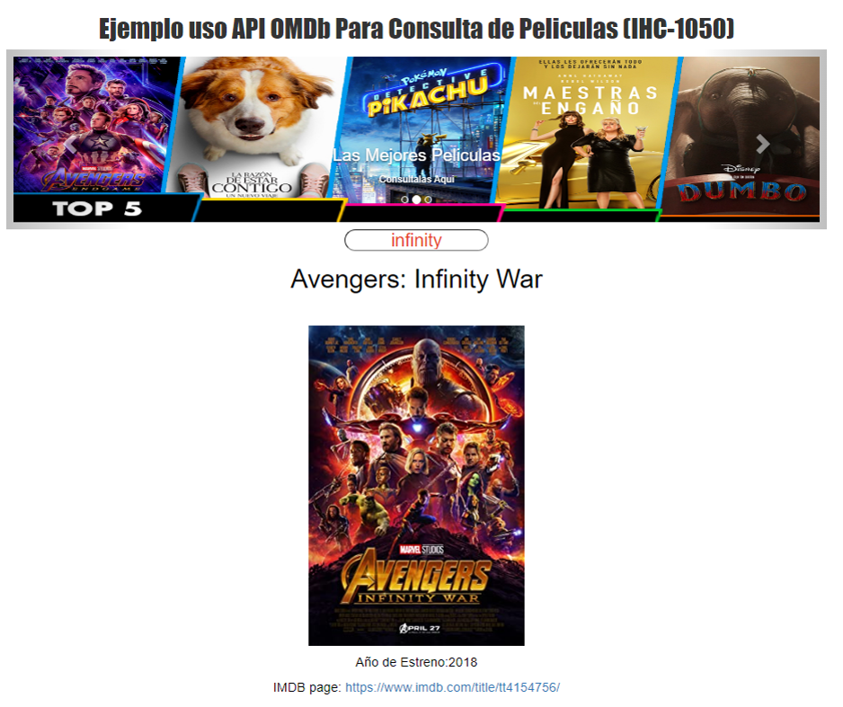

# Consulta de Pelicuas Utilizando la API OMDb

##
😀Uso de la API OMDb_API, y creacion de una Interface y diseños UX-UI, asi como los Lenguaje HTML, CSS, Javascript, Bootstrap, y la  API OMDb_API, para buscar portadas de peliculas, y titulos, años,y Mostrar el Link www.imdb.com con mas Informacion y triller de dicha consultas.

" URL al Proyecto: https://juancitopena.github.io/Buscar_Movies_OMDb_API/"

